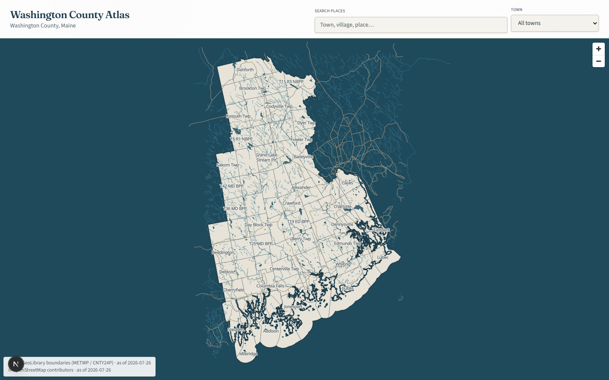
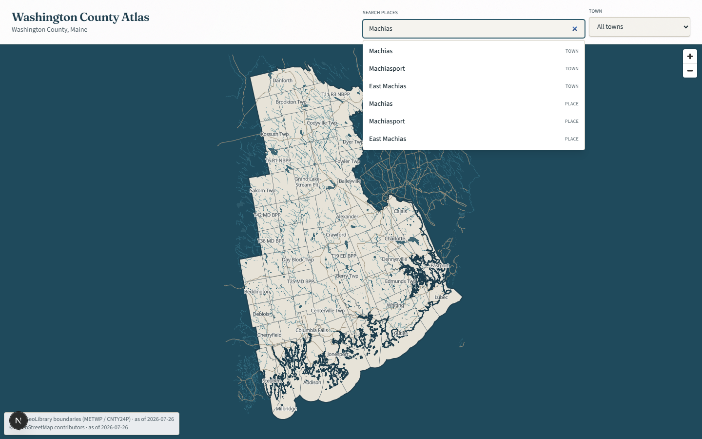
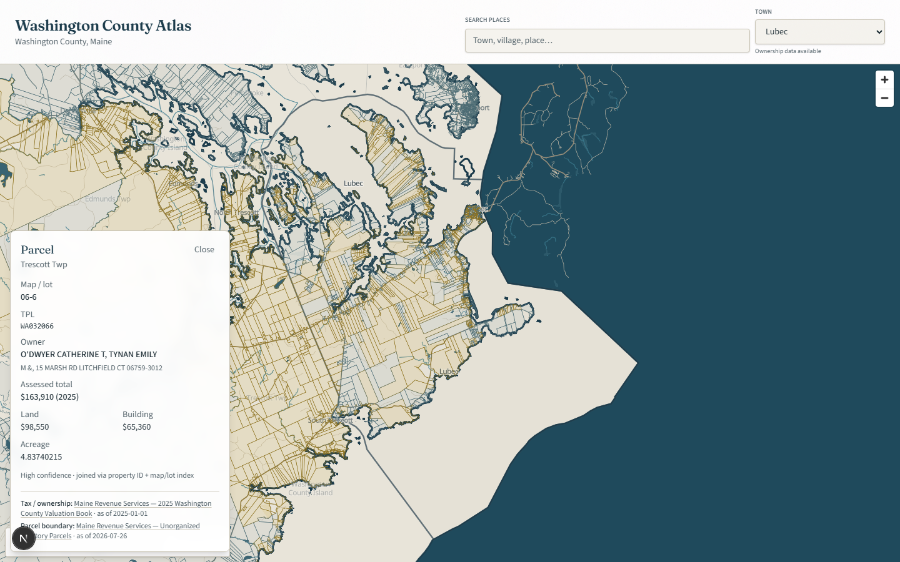

# Washington County Atlas

An interactive geographic atlas for **Washington County, Maine** — combining public datasets into a single searchable interface for casual exploration and professional research.

> **Working title.** Branding is provisional and will change.

**Repository:** [downeasternman/washinton-atlas](https://github.com/downeasternman/washinton-atlas)

**Current version:** `0.0.7` — see [CHANGELOG.md](./CHANGELOG.md)

## Screenshots

| County overview | Place search | Parcel detail |
|-----------------|--------------|---------------|
|  |  |  |

## What this is

A hybrid atlas and parcel research tool: explore the county like a map, then inspect ownership and tax attributes where public data is available. Municipal boundaries are a primary browse/filter. Place-name search is the primary jump path.

**Current coverage (v0.0.7):**

- **30,688 parcels** with geometry on the map (5,396 unorganized territory + 25,292 organized)
- **UT tax joins:** 3,172 / 5,396 parcels with owner and assessed values from Maine Revenue Services 2025 valuation books
- **Organized towns (22 joined):**

| Town | Parcels | Owner joins | Quality joins (owner + assessment) |
|------|---------|-------------|-------------------------------------|
| Lubec | 1,894 | 1,585 (83.7%) | 1,130 (59.7%) |
| Calais | 2,771 | 2,251 (81.2%) | 1,875 (67.7%) |
| Machias | 1,153 | 1,031 (89.4%) | 859 (74.5%) |
| Eastport | 1,983 | 1,673 (84.4%) | 1,391 (70.1%) |
| Baileyville | 1,361 | 1,236 (90.8%) | 1,040 (76.4%) |
| Jonesport | 1,579 | 1,227 (77.7%) | 1,028 (65.1%) |
| Steuben | 1,605 | 1,321 (82.3%) | 1,145 (71.3%) |
| Addison | 1,419 | 1,306 (92.0%) | 1,072 (75.5%) |
| Charlotte | 466 | 412 (88.4%) | 360 (77.3%) |
| Cooper | 370 | 289 (78.1%) | 244 (65.9%) |
| Cutler | 624 | 542 (86.9%) | 448 (71.8%) |
| Milbridge | 1,692 | 731 (43.2%) | 600 (35.5%) |
| Pembroke | 1,006 | 879 (87.4%) | 785 (78.0%) |
| Perry | 1,006 | 852 (84.7%) | 703 (69.9%) |
| Robbinston | 607 | 582 (95.9%) | — (owner-only; assessments not published) |
| Alexander | 840 | 509 (60.6%) | 446 (53.1%) |
| Cherryfield | 1,018 | 1,015 (99.7%) | 949 (93.2%) |
| Columbia Falls | 515 | 460 (89.3%) | 408 (79.2%) |
| Machiasport | 1,226 | 1,131 (92.3%) | 1,002 (81.7%) |
| Marshfield | 425 | 419 (98.6%) | 395 (92.9%) |
| Wesley | 828 | 593 (71.6%) | 574 (69.3%) |
| Whiting | 904 | 903 (99.9%) | 745 (82.4%) |

## Data policy

- Only **publicly obtainable, no-cost** sources are used.
- Every dataset displays **source name** and **as-of date**.
- Tax/ownership data comes from:
  - **Unorganized territories (UT):** Maine Revenue Services state PDFs (Phase D1)
  - **Organized towns/cities:** local municipal commitment PDFs and Maine GeoLibrary parcel geometry (Phase D2)
- Parsed tax values are never invented — null on parse or join failure.
- Regulatory overlays (flood, wetlands, soils, zoning) are informational only when added later.

## Development gates

Work proceeds in gated phases. Each phase stops for review before the next begins.

| Phase | Scope | Status |
|-------|-------|--------|
| **A** | Scaffold — app shell, map stub, schema stubs | Complete |
| **B** | Boundaries & basemap tiles — accurate, polished county map | Complete |
| **C** | Municipality filter + place-name search | Complete |
| **D1** | Unorganized territory tax/ownership ingestion | Complete |
| **D2-SCAFFOLD** | Organized-town pipeline + statewide geometry download | Complete |
| **D2a** | Lubec organized-town pilot + remediation (parser v3) | Complete |
| **D2c** | Calais, Eastport, Machias organized towns | Complete |
| **D2b** | Baileyville, Jonesport, Steuben organized towns | Complete |
| **D2d** | Addison, Charlotte, Cooper, Cutler, Milbridge, Pembroke, Perry, Robbinston (+ Beals failed) | Complete |
| **D2e** | Alexander, Cherryfield, Columbia Falls, Machiasport, Marshfield, Wesley, Whiting (+ 9 failed) | Complete |
| **D2f** | Remaining organized towns (town-by-town rollout) | Planned |
| **E** | Coverage honesty, polish, tests | Planned |

## Stack (v1)

- Next.js (App Router) + TypeScript + React
- Tailwind CSS v4
- MapLibre GL v5 + react-map-gl
- PMTiles for vector tiles
- PostgreSQL + PostGIS + Drizzle ORM (schema stubs; file-backed data in early phases)
- pnpm

## Getting started

### Prerequisites

- Node.js 20+
- pnpm 10+
- PostgreSQL 16 + PostGIS 3 (optional in early phases; required for full search & tax persistence later)
- Optional: `tools/pmtiles-bin/pmtiles.exe` (go-pmtiles) for rebuilding tiles

### Setup

```bash
pnpm install
cp .env.example .env
# Edit .env with your DATABASE_URL when ready
pnpm dev
```

Open [http://localhost:3000](http://localhost:3000).

Phase B basemap tiles and parcel tiles are checked into `public/tiles/`. To rebuild them:

```bash
pnpm phase:b          # boundaries + basemap
pnpm phase:d1         # UT tax ETL + parcel tiles (requires raw PDFs downloaded)
pnpm phase:d2a        # Lubec organized-town pilot
pnpm phase:d2c        # Calais, Eastport, Machias organized towns
pnpm phase:d2b        # Baileyville, Jonesport, Steuben organized towns
pnpm phase:d2d        # D2d commitment-book towns
pnpm phase:d2d-robbinston  # Robbinston owner index + transfer PDFs
pnpm phase:d2e-roque-bluffs  # Roque Bluffs commitment + tax-map catalog
pnpm phase:d2f               # Whitneyville + county organized report
```

> Tile builds use a Node geojson-vt → MBTiles → PMTiles pipeline (Windows-friendly). Shell wrappers live under `scripts/tiles/`.

### Scripts

| Command | Description |
|---------|-------------|
| `pnpm dev` | Start development server |
| `pnpm build` | Production build |
| `pnpm lint` | Run ESLint |
| `pnpm format` | Format with Prettier |
| `pnpm test` | Run unit tests (Vitest) |
| `pnpm test:e2e` | Run end-to-end tests (Playwright) |
| `pnpm etl:boundaries` | Download Maine GeoLibrary county/muni boundaries |
| `pnpm etl:osm` | Download county-clipped OSM (roads, water, places) |
| `pnpm tiles:all` | Build `public/tiles/{basemap,boundaries}.pmtiles` |
| `pnpm phase:b` | Run full Phase B ETL + tile pipeline |
| `pnpm phase:c` | Normalize place-name search index |
| `pnpm phase:d1` | UT tax download, parse, join, merge, and parcel tiles |
| `pnpm phase:d2-scaffold` | Download organized-town parcel geometry statewide |
| `pnpm phase:d2a` | Lubec commitment PDF → join → merge → tiles |
| `pnpm phase:d2c` | Calais, Eastport, Machias commitment PDFs → join → merge → tiles |
| `pnpm phase:d2b` | Baileyville, Jonesport, Steuben commitment PDFs → join → merge → tiles |
| `pnpm phase:d2d` | D2d commitment-book towns → join → merge → tiles |
| `pnpm phase:d2d-robbinston` | Robbinston owner index + transfer PDFs → join → merge → tiles |
| `pnpm phase:d2e` | D2e commitment-book towns → join → merge → tiles |
| `pnpm phase:d2e-roque-bluffs` | Roque Bluffs commitment + tax-map catalog → join → merge → tiles |
| `pnpm phase:d2f` | D2f Whitneyville commitment → join → merge → tiles + county report |

## Data sources (high level)

| Layer | Source | Notes |
|-------|--------|-------|
| Municipal boundaries | Maine GeoLibrary | County clip |
| Roads, water, places | OpenStreetMap | County clip |
| UT parcel geometry | Maine Revenue Services GIS | WAP + Day Block layers |
| UT tax | MRS 2025 valuation books (PDF) | Map/lot index crosswalk |
| Organized geometry | Maine GeoLibrary parcels | 34,881 features county-wide |
| Organized tax | Municipal RE commitment PDFs + Robbinston owner index/transfers | Twenty-four towns joined; see `data/manifest/tax-sources.json` |

## Out of scope for v1

- Ownership/deed history timelines
- Multi-parcel comparison
- FEMA, wetlands, soils, LUPC as product features
- SearchIQS / registry deed document embedding
- User accounts or paywalls
- Print/PDF export
- Final product branding

## License

TBD.
